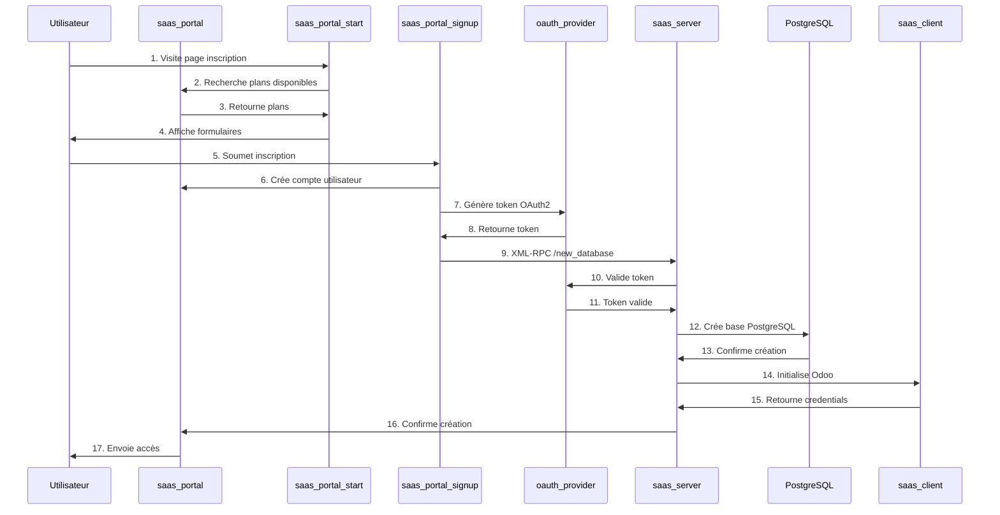

# 📚 Documentation Complète - Odoo SaaS Tools

## 🏗️ Architecture Globale

```
┌─────────────────────────────────────────────────────────────────────┐
│                         SYSTÈME SAAS                                │
│                     Odoo 18.0 Compatible                            │
└──────────────────────┬──────────────────────────────────────────────┘
                       │
                       ▼
        ┌─────────────────────────────────────┐
        │         SAAS PORTAL (Contrôle)      │
        │   • Gestion des plans               │
        │   • Administration clients          │
        │   • Interface d'inscription         │
        │   • Monitoring central              │
        │   • Authentification OAuth2         │
        └────────────┬────────────────────────┘
                     │
                     │ OAuth2 + XML-RPC
                     │
        ┌────────────▼────────────────────────┐
        │        SAAS SERVER (Technique)      │
        │   • Création bases de données       │
        │   • Gestion des instances           │
        │   • Installation modules            │
        │   • Backup automatique              │
        │   • Configuration automatique       │
        └────────────┬────────────────────────┘
                     │
                     │ Création PostgreSQL
                     │
        ┌────────────▼────────────────────────┐
        │      SAAS CLIENTS (Instances)       │
        │   • Instances Odoo isolées          │
        │   • Données clients séparées        │
        │   • Personnalisation possible       │
        │   • Modules installables            │
        └─────────────────────────────────────┘
```

## 📦 Modules par Catégorie

### 🎯 **Core Modules (Modules Principaux)**

#### 1. **saas_base** - Base commune
**Description:** Module de base contenant les classes et outils communs à tous les modules SaaS.

**Dépendances:**
- `base`

**Fichiers clés:**
- `models/saas_base.py` - Modèles de base
- `tools.py` - Utilitaires communs
- `exceptions.py` - Exceptions personnalisées

**Relations:**
- Imports par: `saas_portal`, `saas_server`, `saas_client`
- Fournit: Classes de base pour SaaS

---

#### 2. **saas_portal** - Portail de contrôle
**Description:** Module principal de gestion du portail SaaS (contrôle central).

**Dépendances:**
- `base` ⭐
- `oauth_provider`
- `website`
- `auth_signup`
- `saas_base`

**Fichiers clés:**
```
saas_portal/
├── models/
│   ├── saas_portal.py      # Plans, Clients, Servers
│   └── res_users.py        # Extension utilisateurs
├── controllers/
│   └── main.py             # Routes web
├── wizard/
│   └── config_wizard.py    # Assistants de création
└── views/
    └── saas_portal_views.xml
```

**Tables principales:**
- `saas_portal.plan` - Plans d'abonnement
- `saas_portal.client` - Clients SaaS
- `saas_portal.server` - Serveurs SaaS

**Relations:**
- OAuth2 → `saas_server`
- UI → Plans et Clients
- Monitoring → Servers

---

#### 3. **saas_server** - Serveur technique
**Description:** Module pour la création et gestion des bases de données clients.

**Dépendances:**
- `base` ⭐
- `auth_oauth`
- `auth_oauth_ip`
- `saas_base`
- `website`

**Fichiers clés:**
```
saas_server/
├── models/
│   └── saas_server.py      # Gestion bases clients
├── controllers/
│   └── main.py             # Endpoint création DB
└── views/
    └── saas_server_views.xml
```

**Tables principales:**
- `saas_server.client` - Bases de données clients
- `saas_server.repository` - Dépôts modules

**Endpoints RPC:**
- `/saas_server/new_database` - Création DB
- `/saas_server/edit_database` - Modification DB

**Relations:**
- Reçoit requêtes OAuth2 du Portal
- Crée bases PostgreSQL
- Initialise instances Odoo

---

#### 4. **saas_client** - Module client
**Description:** Module installé dans chaque instance client pour limitations et OAuth.

**Dépendances:**
- `base` ⭐
- `auth_oauth`
- `auth_oauth_ip`
- `auth_oauth_check_client_id`
- `mail`
- `web_settings_dashboard`
- `access_limit_records_number`

**Fichiers clés:**
```
saas_client/
├── models/
│   ├── res_user.py         # Limitation utilisateurs
│   └── saas_client.py      # Configuration client
├── controllers/
│   └── main.py             # Routes OAuth
└── views/
    └── saas_client_views.xml
```

**Fonctionnalités:**
- Limite nombre d'utilisateurs
- Configuration OAuth
- Authentification sécurisée

**Relations:**
- Installé dans chaque instance client
- Communique avec Server via OAuth

---

### 🔐 **Authentication & OAuth**

#### 5. **oauth_provider** - Fournisseur OAuth
**Description:** Module OAuth2 pour l'authentification entre Portal et Server.

**Dépendances:**
- `base`
- `auth_oauth`
- `web`

**Fichiers clés:**
```
oauth_provider/
├── models/
│   └── oauth_provider.py   # Gestion tokens
├── controllers/
│   └── auth.py             # Endpoints auth
└── validators.py           # Validation tokens
```

**Tables principales:**
- `oauth.application` - Applications OAuth
- `oauth.access_token` - Tokens d'accès

**Relations:**
- Fournit OAuth2 pour Portal ↔ Server
- Sécurise les communications

---

#### 6. **auth_oauth_ip** - OAuth par IP
**Description:** Contrôle d'accès OAuth basé sur les adresses IP.

**Dépendances:**
- `base`
- `auth_oauth`

**Fichiers clés:**
- `models.py` - Validation IP
- `views.xml` - Interface

**Relations:**
- Utilisé par `saas_portal` et `saas_server`
- Sécurité supplémentaire

---

#### 7. **auth_oauth_check_client_id** - Validation Client ID
**Description:** Validation strict du client_id OAuth.

**Dépendances:**
- `base`
- `auth_oauth`

**Fichiers clés:**
- `models/` - Contrôles validation

**Relations:**
- Utilisé par toutes les instances

---

### 🎯 **Portal Modules (Fonctionnalités Portal)**

#### 8. **saas_portal_start** - Page de démarrage
**Description:** Page d'inscription et sélection de plans.

**Dépendances:**
- `portal`
- `saas_portal`
- `website`

**Fichiers clés:**
```
saas_portal_start/
├── controllers/
│   └── main.py             # Page inscription
├── views/
│   └── website_templates.xml
└── data/
    └── website_data.xml
```

**Fonctionnalités:**
- Page d'accueil
- Sélection plans
- Formulaires inscription

---

#### 9. **saas_portal_portal** - Espace client
**Description:** Interface client pour gérer ses instances.

**Dépendances:**
- `portal` ⭐
- `saas_portal` ⭐
- `website` ⭐ (AJOUTÉ)

**Fichiers clés:**
```
saas_portal_portal/
├── controllers/
│   └── main.py             # Routes client
├── views/
│   └── website_instance_templates.xml
└── static/
    └── src/js/main.js      # JS personnalisé
```

**Fonctionnalités:**
- Liste instances client
- Gestion domaines
- Dashboard client

---

#### 10. **saas_portal_signup** - Inscription
**Description:** Gestion du processus d'inscription.

**Dépendances:**
- `auth_signup`
- `saas_portal`

**Fichiers clés:**
```
saas_portal_signup/
├── controllers/
│   └── main.py             # Processus inscription
└── views/
    └── templates.xml
```

**Relations:**
- Appelé par `saas_portal_start`
- Crée compte utilisateur
- Déclenche création instance

---

#### 11. **saas_portal_signup_custom** - Inscription personnalisée
**Description:** Extension pour inscription personnalisée.

**Dépendances:**
- `auth_signup`
- `saas_portal`
- `saas_portal_signup`

**Fichiers clés:**
- `controllers/main.py` - Extension inscription
- `views/` - Templates personnalisés

---

#### 12. **saas_portal_templates** - Templates
**Description:** Templates réutilisables pour le portail.

**Dépendances:**
- `saas_portal`
- `website`

**Fichiers clés:**
- `views/` - Templates
- `data/` - Données

---

#### 13. **saas_portal_subscription** - Abonnements
**Description:** Gestion des abonnements et renouvellements.

**Dépendances:**
- `saas_portal`
- `sale_subscription` (optionnel)

**Fichiers clés:**
```
saas_portal_subscription/
├── models/
│   └── saas_portal.py      # Abonnements
└── views/
    └── subscription_views.xml
```

**Fonctionnalités:**
- Gestion abonnements
- Renouvellement auto
- Expiration

---

#### 14. **saas_portal_sale** - Vente
**Description:** Intégration avec le module de vente.

**Dépendances:**
- `saas_portal`
- `sale`

**Fichiers clés:**
```
saas_portal_sale/
├── models/
│   └── saas_portal.py      # Devis et commandes
└── views/
    └── sale_views.xml
```

**Fonctionnalités:**
- Création devis
- Commandes
- Facturation

---

#### 15. **saas_portal_sale_online** - Vente en ligne
**Description:** Boutique en ligne pour plans SaaS.

**Dépendances:**
- `saas_portal`
- `saas_portal_sale`
- `website_sale`

**Fichiers clés:**
- `controllers/` - Routes boutique
- `views/` - Templates boutique

---

#### 16. **saas_portal_sale_subscription** - Vente d'abonnements
**Description:** Vente d'abonnements intégrée.

**Dépendances:**
- `saas_portal`
- `saas_portal_sale`
- `sale_subscription`

**Fichiers clés:**
```
saas_portal_sale_subscription/
├── models/
│   └── saas_portal.py      # Abonnements vente
└── wizard/
    └── subscription_wizard.py
```

---

#### 17. **saas_portal_tagging** - Tags
**Description:** Système de tags pour clients.

**Dépendances:**
- `saas_portal`

**Fichiers clés:**
```
saas_portal_tagging/
├── models/
│   └── saas_portal_tagging.py  # Tags clients
└── views/
    └── tagging_views.xml
```

**Fonctionnalités:**
- Catégorisation clients
- Organisation plans

---

#### 18. **saas_portal_demo** - Démonstration
**Description:** Fonctionnalités de démonstration.

**Dépendances:**
- `saas_portal`
- `website`

**Fichiers clés:**
- `controllers/` - Démo
- `views/` - Templates démo

---

#### 19. **saas_portal_backup** - Backup
**Description:** Gestion des sauvegardes.

**Dépendances:**
- `saas_portal`

**Fichiers clés:**
- `models/` - Gestion backup
- `wizard/` - Assistants

---

#### 20. **saas_portal_async** - Traitement asynchrone
**Description:** Traitement asynchrone des opérations.

**Dépendances:**
- `saas_portal`
- `queue_job` (optionnel)

**Fichiers clés:**
- `models/` - Jobs asynchrones

---

### 🖥️ **Server Modules (Module Serveur)**

#### 21. **saas_server_demo** - Démonstration serveur
**Description:** Fonctionnalités de démonstration pour le serveur.

**Dépendances:**
- `saas_server`
- `saas_portal_demo`

**Fichiers clés:**
- `models/` - Repositories
- `wizard/` - Setup démo

---

#### 22. **saas_server_autodelete** - Auto-suppression
**Description:** Suppression automatique des bases expirées.

**Dépendances:**
- `saas_server`

**Fichiers clés:**
- `models/` - Cron suppressions
- `wizard/` - Configuration

**Fonctionnalités:**
- Cleanup automatique
- Expiration bases
- Backup avant suppression

---

#### 23. **saas_server_backup_ftp** - Backup FTP
**Description:** Sauvegarde automatique vers FTP.

**Dépendances:**
- `saas_server`

**Fichiers clés:**
```
saas_server_backup_ftp/
├── models/
│   └── saas_server.py      # Backup FTP
└── views/
    └── backup_views.xml
```

**Fonctionnalités:**
- Backup quotidien
- Upload FTP
- Rétention configurable

---

#### 24. **saas_server_backup_rotate** - Rotation backups
**Description:** Rotation des sauvegardes locales.

**Dépendances:**
- `saas_server`

**Fichiers clés:**
- `models/` - Rotation backups

**Fonctionnalités:**
- Rotation automatique
- Nettoyage anciens
- Politique de rétention

---

#### 25. **saas_server_backup_s3** - Backup S3
**Description:** Sauvegarde vers AWS S3.

**Dépendances:**
- `saas_server`

**Fichiers clés:**
```
saas_server_backup_s3/
├── models/
│   └── saas_server.py      # Backup S3
└── views/
    └── s3_views.xml
```

**Fonctionnalités:**
- Upload S3
- Versioning
- Compression

---

#### 26. **saas_server_backup_rotate_s3** - Rotation S3
**Description:** Rotation des backups sur S3.

**Dépendances:**
- `saas_server_backup_s3`

**Fichiers clés:**
- `models/` - Rotation S3

---

### 🔧 **Sysadmin Modules (Administration Système)**

#### 27. **saas_sysadmin** - Administration
**Description:** Module d'administration système.

**Dépendances:**
- `base`
- `saas_portal`

**Fichiers clés:**
- `models/` - Config système
- `views/` - Interface admin

---

#### 28. **saas_sysadmin_aws** - AWS Integration
**Description:** Intégration Amazon Web Services.

**Dépendances:**
- `saas_sysadmin`

**Fichiers clés:**
```
saas_sysadmin_aws/
├── models/
│   └── saas_sysadmin_aws.py    # AWS EC2/S3
└── views/
    └── aws_views.xml
```

**Fonctionnalités:**
- Instances EC2
- S3 storage
- Auto-scaling

**Relations:**
- Utilisé par `saas_server` pour déploiement cloud

---

#### 29. **saas_sysadmin_aws_route53** - AWS Route53
**Description:** Gestion DNS avec AWS Route53.

**Dépendances:**
- `saas_sysadmin`
- `saas_sysadmin_aws`

**Fichiers clés:**
```
saas_sysadmin_aws_route53/
├── models/
│   └── saas_sysadmin_aws_route53.py  # DNS AWS
└── views/
    └── route53_views.xml
```

**Fonctionnalités:**
- Création zones DNS
- Enregistrements CNAME
- Auto-configuration

---

#### 30. **saas_sysadmin_mailgun** - Mailgun Integration
**Description:** Intégration Mailgun pour emails.

**Dépendances:**
- `saas_sysadmin`

**Fichiers clés:**
```
saas_sysadmin_mailgun/
├── models/
│   └── saas_sysadmin_mailgun.py      # Emails
└── views/
    └── mailgun_views.xml
```

**Fonctionnalités:**
- Envoi emails
- Templates
- Tracking

---

#### 31. **saas_sysadmin_route53** - Route53 Générique
**Description:** Gestion DNS Route53 (non-AWS).

**Dépendances:**
- `saas_sysadmin`

**Fichiers clés:**
- `models/` - DNS management
- `views/` - Interface DNS

**Relations:**
- Alternative à `saas_sysadmin_aws_route53`

---

### 🛠️ **Utilitaires**

#### 32. **saas_utils** - Utilitaires
**Description:** Fonctions utilitaires communes.

**Dépendances:**
- `base`

**Fichiers clés:**
- `tools.py` - Utilitaires
- `models/` - Helpers

**Relations:**
- Utilisé par tous les modules

---

### 📋 **auth_oauth_ip** - OAuth IP
**Description:** Contrôle OAuth par adresse IP.

**Dépendances:**
- `base`
- `auth_oauth`

**Fichiers clés:**
```
auth_oauth_ip/
├── models.py                # Validation IP
├── views.xml                # Configuration
└── README.rst              # Documentation
```

**Relations:**
- Sécurité additionnelle
- Utilisé par Portal et Server

---

## 🔄 Flux de Données Complets

### 1️⃣ **Création d'un Client**



### 2️⃣ **Architecture des Dépendances**

```
┌─────────────────────────────────────────────┐
│                   base                      │ ← Fondation
└────────┬────────────────────────────────────┘
         │
         ├─► oauth_provider ───► auth_oauth_ip
         │
         ├─► saas_base ───────────────────────────────┐
         │                                             │
         │   ┌─────────────────────────────────────────▼─┐
         │   │         saas_portal                     │
         │   │   (Contrôle central)                     │
         │   └─┬───────────────────────────────────────┘
         │     │
         │     ├─► saas_portal_start
         │     ├─► saas_portal_portal
         │     ├─► saas_portal_signup
         │     ├─► saas_portal_templates
         │     ├─► saas_portal_subscription
         │     ├─► saas_portal_sale
         │     ├─► saas_portal_sale_online
         │     └─► saas_portal_sale_subscription
         │
         │   ┌─────────────────────────────────────────▼─┐
         │   │         saas_server                      │
         │   │   (Gestion technique)                    │
         │   └─┬───────────────────────────────────────┘
         │     │
         │     ├─► saas_server_demo
         │     ├─► saas_server_autodelete
         │     ├─► saas_server_backup_ftp
         │     ├─► saas_server_backup_rotate
         │     └─► saas_server_backup_s3
         │
         │   ┌─────────────────────────────────────────▼─┐
         │   │         saas_client                      │
         │   │   (Instance client)                      │
         │   └───────────────────────────────────────────┘
         │
         └─► saas_utils (utilitaires)
```

### 3️⃣ **Tables de Base de Données Principales**

#### **Portal Database**
```sql
-- Plans d'abonnement
saas_portal_plan
├── name                    (Nom plan)
├── template_id             (Template base)
├── description             (Description)
├── price                   (Prix)
└── trial_days              (Jours essai)

-- Clients SaaS
saas_portal_client
├── name                    (Nom client)
├── plan_id                 (Plan associé)
├── server_id               (Serveur)
├── database_id             (ID base)
├── partner_id              (Contact)
└── expiration_datetime     (Expiration)

-- Serveurs SaaS
saas_portal_server
├── name                    (Nom serveur)
├── hostname                (Hostname)
├── oauth_application_id    (OAuth)
├── max_clients             (Limite)
└── active                  (Actif)
```

#### **Server Database**
```sql
-- Instances clients
saas_server_client
├── name                    (Nom instance)
├── client_id               (ID client)
├── database_name           (Nom DB)
├── host                    (Host)
├── trial                   (Essai)
└── expiration_datetime     (Expiration)

-- Repositories
saas_server_repository
├── name                    (Nom)
├── url                     (URL)
└── branch                  (Branche)
```

#### **Client Database**
```sql
-- Configuration client
saas_client_config
├── max_users               (Limite users)
├── max_records             (Limite records)
└── features                (Fonctionnalités)
```

## 🚀 Déploiement et Configuration

### Configuration Requise

#### **1. Variables d'Environnement**
```bash
# Database
DB_HOST=localhost
DB_PORT=5432
DB_USER=odoo
DB_PASSWORD=your_password

# Odoo
ODOO_ADMIN_PASSWD=admin
ODOO_URL=http://localhost:8069

# OAuth (Portal → Server)
OAUTH_CLIENT_ID=your_client_id
OAUTH_CLIENT_SECRET=your_secret

# AWS (Optionnel)
AWS_ACCESS_KEY_ID=xxx
AWS_SECRET_ACCESS_KEY=xxx
```

#### **2. Odoo Configuration**
```ini
[options]
# Base
admin_passwd = admin
db_host = localhost
db_port = 5432
db_user = odoo

# Addons
addons_path = /path/to/odoo-saas-tools,/path/to/odoo/addons

# Performance
workers = 4
max_cron_threads = 2
limit_memory_hard = 2684354560
limit_memory_soft = 2147483648

# Security
xmlrpc_port = 8069
longpolling_port = 8072
```

## 📊 Taille et Relations des Modules

| Module | Dépendances | Utilisé par | Tables | Complexité |
|--------|-------------|-------------|---------|-----------|
| **saas_base** | `base` | Tous | 0 | ⭐ |
| **saas_portal** | `base`, `oauth`, `website`, `saas_base` | Portal modules | 15+ | ⭐⭐⭐⭐⭐ |
| **saas_server** | `base`, `auth_oauth`, `saas_base` | Server modules | 10+ | ⭐⭐⭐⭐ |
| **saas_client** | `base`, `auth_oauth`, `mail` | Instance clients | 5+ | ⭐⭐ |
| **oauth_provider** | `base`, `auth_oauth` | Portal, Server | 3+ | ⭐⭐⭐ |
| **saas_portal_start** | `portal`, `saas_portal`, `website` | - | 2+ | ⭐⭐ |
| **saas_portal_portal** | `portal`, `saas_portal`, `website` | - | 1+ | ⭐⭐ |

## 🎯 Mode de Fonctionnement Complet

### **Phase 1: Initialisation**
1. Installation Odoo 18
2. Configuration PostgreSQL
3. Création base Portal
4. Création base Server
5. Configuration OAuth

### **Phase 2: Configuration**
1. Définition plans d'abonnement
2. Configuration serveurs
3. Définition templates
4. Configuration backup

### **Phase 3: Opération**
1. Client s'inscrit
2. Sélectionne un plan
3. Système crée instance automatiquement
4. Client accède à son instance

### **Phase 4: Maintenance**
1. Monitoring instances
2. Backups automatiques
3. Renouvellements
4. Support clients

## 📝 Notes Importantes

### **Clés de Configuration**
- ⭐ = **Dépendance Critique** - Nécessaire pour le fonctionnement
- OAuth2 = Sécurisation Portal ↔ Server
- PostgreSQL = Isolation des données clients
- XML-RPC = Communication inter-instances

### **Composition par Instance**
- **Portal:** 1 instance centrale
- **Server:** N instances (1 par cluster)
- **Client:** 1 instance par client

### **Sécurité**
- OAuth2 entre Portal et Server
- Isolation bases de données
- Validation IP optionnelle
- Tokens d'accès sécurisés

---

**Version:** 18.0.1.0.0  
**Compatible avec:** Odoo 18.0  
**License:** LGPL-3  
**Support:** apps@itexperts4africa.com

