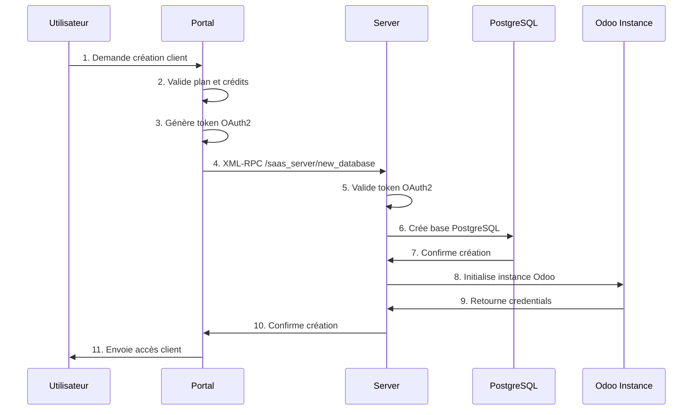

# Comment fonctionne votre SaaS : Guide Complet

## 🏗️ Architecture en 3 Niveaux

```
┌─────────────────────────────────────────────────────────────┐
│                     SAAS PORTAL                            │
│  • Contrôle central (saas-portal-18.local)                 │
│  • Gestion des plans d'abonnement                          │
│  • Interface d'administration                              │
│  • Authentification OAuth2                                │
└────────────┬────────────────────────────────────────────────┘
             │ Commande de création via XML-RPC
             ▼
┌─────────────────────────────────────────────────────────────┐
│                     SAAS SERVER                             │
│  • Serveur technique (server-1.saas-portal-18.local)       │
│  • Création/gestion des bases de données                    │
│  • Installation de modules                                  │
│  • Configuration automatique                                 │
└────────────┬────────────────────────────────────────────────┘
             │ Création physique de la base
             ▼
┌─────────────────────────────────────────────────────────────┐
│                     SAAS CLIENTS                            │
│  • Instances Odoo individuelles                             │
│  • client-1.saas-portal-18.local                            │
│  • Données isolées par client                               │
│  • Personnalisation possible                                │
└─────────────────────────────────────────────────────────────┘
```

## 🔄 Flux de Création d'un Client

### 1️⃣ Création via l'Interface Web

```bash
# URL d'accès
http://localhost:8069/web?db=saas-portal-18.local

# Connexion
Admin / Admin
```

**Étapes dans l'interface :**
1. Menu : `Apps > SaaS Portal > Create Client`
2. Sélection du plan d'abonnement
3. Remplissage des informations client
4. Sélection du serveur SaaS
5. Clic sur "Create & Deploy"
6. ✨ **Instance créée automatiquement** en quelques secondes

### 2️⃣ Création via Script Python

```python
# Via XML-RPC depuis le Portal
import xmlrpc.client

url = "http://localhost:8069"
db = "saas-portal-18.local"
username = "admin"
password = "admin"

# Connexion
common = xmlrpc.client.ServerProxy('{}/xmlrpc/2/common'.format(url))
uid = common.authenticate(db, username, password, {})

# Création du client
models = xmlrpc.client.ServerProxy('{}/xmlrpc/2/object'.format(url))
client_id = models.execute_kw(db, uid, password,
    'saas_portal.create_client', 'create', [{
        'name': 'client-1',
        'plan_id': 1,
        'server_id': 1,
        'subdomain': 'client1'
    }])

# ✨ L'instance est créée automatiquement
```

### 3️⃣ Création via API REST

```bash
curl -X POST http://localhost:8069/api/saas/client \
  -H "Content-Type: application/json" \
  -H "Cookie: session_id=..." \
  -d '{
    "name": "client-1",
    "plan_id": 1,
    "subdomain": "client1",
    "template_id": 1
  }'
```

## 🛠️ Architecture Technique

### Processus Détaillé de Création



### Fichiers Clés

#### 1. **Portal** (`saas_portal/`)
- `models/saas_portal.py` : Modèles de données (Plan, Client, Server)
- `controllers/main.py` : Controllers web
- `wizard/config_wizard.py` : Wizards de création

#### 2. **Server** (`saas_server/`)
- `models/saas_server.py` : Gestion des bases clients
- `controllers/main.py` : Endpoint de création DB
- Méthode clé : `create_database()` copie un template et initialise

#### 3. **Client** (`saas_client/`)
- Instance Odoo isolée par client
- Données complètement séparées
- Personnalisation possible

## 💾 Gestion des Bases de Données

### Schéma des Bases

```
postgresql
├── odoo (base principale)
├── saas-portal-18.local (portal de contrôle)
├── server-1.saas-portal-18.local (serveur technique)
├── client-1.saas-portal-18.local (client 1)
├── client-2.saas-portal-18.local (client 2)
└── ...
```

### Tables Importantes

**Portal** (`saas_portal_plan`, `saas_portal_client`) :
- Plans d'abonnement
- Liste des clients
- Facturation

**Server** (`saas_server_client`) :
- Bases actives
- Configuration technique
- Métriques

**Client** :
- Données métier complètes
- Modules installés
- Utilisateurs

## 🔧 Configuration Requise

### Fichier `odoo.conf`

```ini
[options]
admin_passwd = admin
db_host = localhost
db_port = 5432
db_user = apple
addons_path = /Users/apple/KONDRO/odoo-sass/odoo-saas-tools,/Users/apple/KONDRO/odoo-sass/odoo/addons
xmlrpc_port = 8069
```

### Modules Nécessaires

**Portal** :
- `base`
- `auth_signup`
- `saas_portal`
- `website`

**Server** :
- `saas_server`
- `auth_oauth`

**Client** :
- `saas_client`
- Modules métier choisis

## 🚀 Démarrage Rapide

### 1. Créer le Système

```bash
# Créer Portal
python saas.py --portal-create --server-create --plan-create --run

# Le système est prêt !
```

### 2. Accéder au Portal

```bash
# URL
http://localhost:8069/web?db=saas-portal-18.local

# Login
admin / admin
```

### 3. Créer un Client

**Via Interface :**
1. Apps > SaaS > Create Client
2. Sélectionner plan
3. Créer ✨

**Via Script :**

```bash
python saas.py --create-client \
  --client-name "client-1" \
  --plan-id 1
```

## 📊 Exemples d'Utilisation

### Créer un Plan d'Abonnement

```python
# Dans le Portal
plan = env['saas_portal.plan'].create({
    'name': 'Plan Starter',
    'price': 99.00,
    'trial': 14,
    'template_id': template_id,
    'install_modules': 'sales,crm,inventory',
})
```

### Créer un Client

```python
# Dans le Portal
client = env['saas_portal.client'].create({
    'name': 'acme-corp',
    'plan_id': plan_id,
    'server_id': server_id,
})

# ✨ Instance créée automatiquement sur le Server
```

### Monitorer les Instances

```python
# Dans le Server
clients = env['saas_server.client'].search([])
for client in clients:
    print(f"{client.name}: {client.state}")
```

## 🔐 Sécurité OAuth2

Le système utilise OAuth2 pour communiquer entre Portal et Server :

1. **Portal** génère un token
2. **Server** valide le token
3. **Action** est exécutée si valide

Cela garantit que seules les requêtes autorisées peuvent créer des bases.

## 💰 Monétisation

### Plans et Abonnements

**Via `saas_portal_sale` :**
- Plans tarifés automatiquement
- Abonnements récurrents
- Facturation automatique

**Via `saas_portal_sale_subscription` :**
- Souscriptions Odoo native
- Renouvellement auto
- Gestion des échéances

## 📈 Scaling

### Multi-Servers

Vous pouvez ajouter plusieurs serveurs :

```python
server1 = env['saas_portal.server'].create({
    'name': 'US-East',
    'local_host': 'us-east.saas.com',
})

server2 = env['saas_portal.server'].create({
    'name': 'EU-West',
    'local_host': 'eu-west.saas.com',
})
```

Le système répartira automatiquement les clients.

### Backup Automatique

**Via `saas_server_backup_ftp` :**
- Backup quotidien sur FTP
- Rétention configurable

**Via `saas_server_backup_s3` :**
- Backup sur AWS S3
- Versioning activable

## 🎯 Conclusion

Votre système SaaS permet de :

✅ **Créer automatiquement** des instances Odoo pour vos clients  
✅ **Gérer centralement** tous les clients et serveurs  
✅ **Monétiser** via des plans d'abonnement  
✅ **Sécuriser** via OAuth2 entre Portal et Server  
✅ **Scaler** en ajoutant de nouveaux serveurs  

**C'est prêt à l'emploi ! 🚀**

