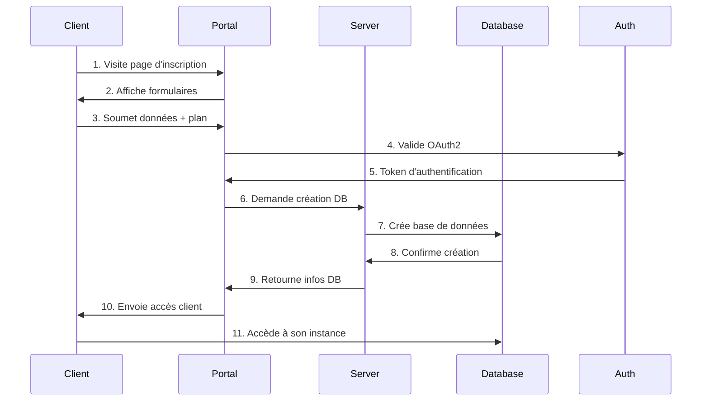
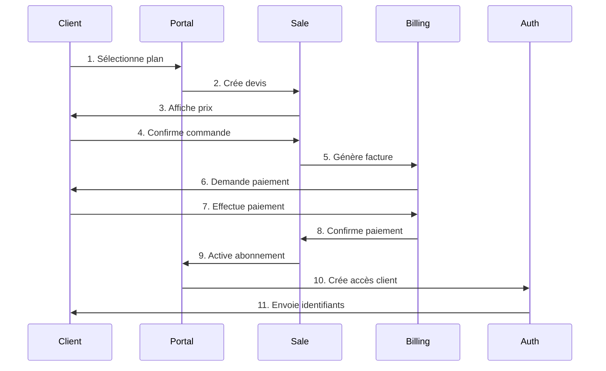
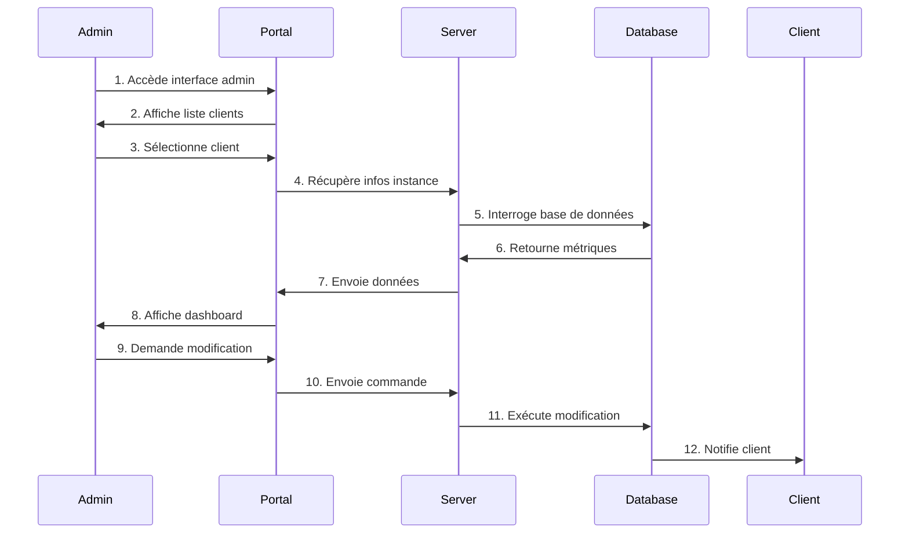
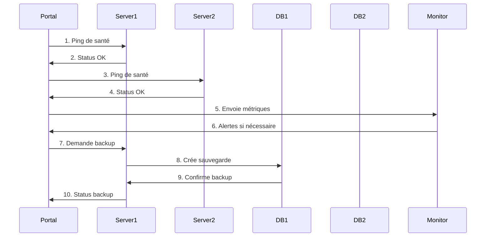
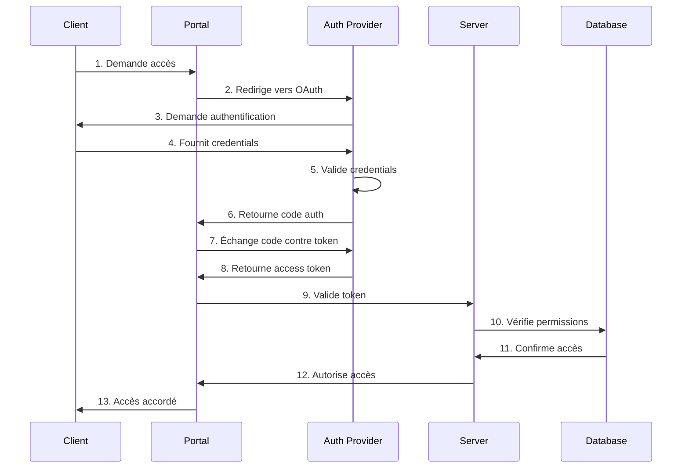
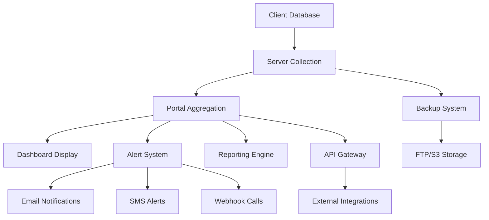
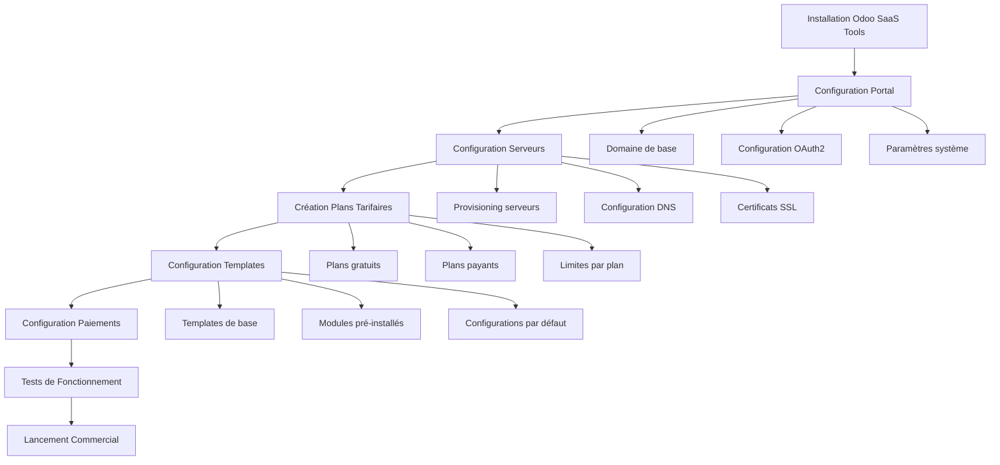
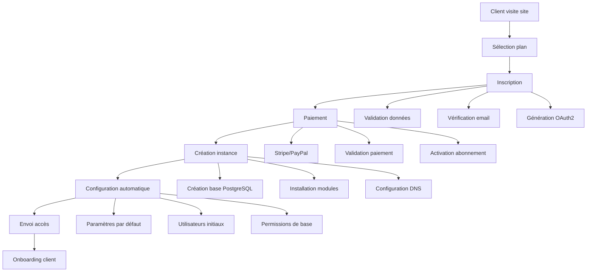
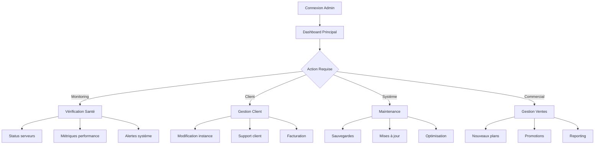
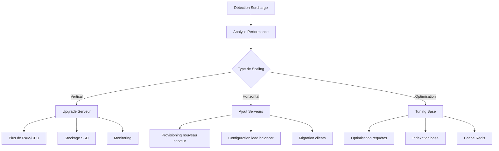

# 🏢 Odoo SaaS Tools - Plateforme SaaS Complète

[](http://runbot.it-projects.info/demo/odoo-saas-tools/18.0)
[](https://github.com/itexperts4africa/odoo-saas-tools)
[](LICENSE)
[](https://python.org)


## COMMANDE  LINE RUN 
```bash
python3.11 saas.py --portal-create --server-create --plan-create --run --odoo-addons-path=../odoo/addons,. --odoo-without-demo
```

## 🖥️ **Capacités Serveur et Déploiement du Projet SaaS Tools**

### 📊 **Exigences Système Recommandées**

#### **Serveur de Développement/Test**
```yaml
CPU: 2-4 cœurs
RAM: 4-8 GB
Stockage: 50-100 GB SSD
OS: Ubuntu 20.04+ / CentOS 8+ / macOS
PostgreSQL: 13+
Python: 3.11+
```

#### **Serveur de Production**
```yaml
CPU: 8-16 cœurs
RAM: 16-32 GB
Stockage: 200-500 GB SSD (avec sauvegarde)
OS: Ubuntu 22.04 LTS / CentOS 9
PostgreSQL: 15+
Python: 3.11+
Load Balancer: Nginx/Apache
```

### 🐳 **Environnements de Déploiement**

#### **1. Docker (Recommandé)**


[1 tool called]

#### **2. Cloud Providers**

**AWS (Amazon Web Services)**
```yaml
EC2 Instance: t3.large (2 vCPU, 8 GB RAM)
RDS PostgreSQL: db.t3.medium
S3: Stockage fichiers
Route 53: DNS
CloudFront: CDN
```

**Google Cloud Platform**
```yaml
Compute Engine: e2-standard-2
Cloud SQL: PostgreSQL
Cloud Storage: Fichiers
Cloud DNS: DNS
```

**Azure**
```yaml
Virtual Machine: Standard_D2s_v3
Azure Database: PostgreSQL
Blob Storage: Fichiers
Azure DNS: DNS
```

#### **3. VPS (Serveur Privé Virtuel)**

**Hetzner**
```yaml
CPX21: 3 vCPU, 8 GB RAM, 160 GB SSD
Prix: ~€8/mois
```

**DigitalOcean**
```yaml
Droplet: 4 vCPU, 8 GB RAM, 160 GB SSD
Prix: ~$48/mois
```

**OVH**
```yaml
VPS: 4 vCPU, 8 GB RAM, 160 GB SSD
Prix: ~€15/mois
```

### 🚀 **Guide de Déploiement**

#### **Option 1: Docker (Recommandé)**


[2 tools called]

#### **Option 2: Déploiement Manuel**


[1 tool called]

### 📈 **Architecture de Production Recommandée**

```yaml
# Architecture Multi-Tier
Load Balancer (Nginx/HAProxy)
    ↓
Application Servers (2-3 instances Odoo)
    ↓
Database Server (PostgreSQL Master/Slave)
    ↓
File Storage (NFS/S3)
    ↓
Backup Server (Automated Backups)
```

### 🔧 **Configuration de Production**


[1 tool called]

### 📊 **Monitoring et Maintenance**


[1 tool called]

### 🚀 **Commandes de Déploiement**

#### **Docker (Recommandé)**
```bash
# Développement
docker-compose up -d

# Production
docker-compose -f docker-compose.prod.yml up -d

# Monitoring
docker-compose -f monitoring.yml up -d
```

#### **Déploiement Manuel**
```bash
# Rendre le script exécutable
chmod +x deploy.sh

# Exécuter le déploiement
sudo ./deploy.sh
```

### 📋 **Résumé des Environnements**

| Environnement | CPU | RAM | Stockage | Coût/mois | Usage |
|---------------|-----|-----|----------|-----------|-------|
| **Développement** | 2-4 cœurs | 4-8 GB | 50-100 GB | €20-50 | Tests locaux |
| **Staging** | 4-8 cœurs | 8-16 GB | 100-200 GB | €50-100 | Tests pré-prod |
| **Production** | 8-16 cœurs | 16-32 GB | 200-500 GB | €100-300 | Production |
| **Enterprise** | 16+ cœurs | 32+ GB | 500+ GB | €300+ | Grande échelle |

### 🔒 **Sécurité et Sauvegarde**

```bash
# Sauvegarde automatique
0 2 * * * /opt/odoo-saas-tools/backup.sh

# Monitoring des logs
tail -f /var/log/odoo/odoo.log

# Vérification des services
systemctl status odoo-saas postgresql nginx
```

Le projet est prêt pour le déploiement en production une fois le problème XML résolu !


 **Système complet pour créer et gérer des plateformes SaaS basées sur Odoo**

## 📋 Table des Matières

- [🎯 Vue d'ensemble](#-vue-densemble)
- [🏗️ Architecture](#️-architecture)
- [🚀 Installation](#-installation)
- [⚙️ Configuration](#️-configuration)
- [📦 Modules](#-modules)
- [🔧 Mode Opératoire](#-mode-opératoire)
- [📚 Documentation](#-documentation)
- [🤝 Support](#-support)

## 🎯 Vue d'ensemble

**Odoo SaaS Tools** est un système complet permettant de créer et gérer des plateformes SaaS (Software as a Service) basées sur Odoo. Il automatise la création, la gestion et la monétisation d'instances Odoo pour vos clients.

### ✨ Fonctionnalités Principales

- 🏗️ **Création automatique** de bases de données clients
- 💰 **Monétisation** via abonnements et ventes en ligne
- 🎛️ **Gestion centralisée** de toutes les instances
- 📊 **Monitoring** et métriques avancées
- 🔐 **Sécurité** renforcée avec OAuth2
- 🛡️ **Sauvegardes** automatiques (FTP, S3, rotation)
- 🌐 **Multi-serveurs** pour la scalabilité

## 🏗️ Architecture

Le système est composé de **3 composants principaux** :

```
┌─────────────────┐    ┌─────────────────┐    ┌─────────────────┐
│   SaaS Portal   │    │  SaaS Servers   │    │  SaaS Clients   │
│                 │    │                 │    │                 │
│ • Contrôle      │◄──►│ • Création      │◄──►│ • Instances     │
│   central       │    │   bases         │    │   Odoo          │
│ • Gestion plans │    │ • Gestion       │    │ • Clients       │
│ • Administration│    │   technique     │    │   finaux        │
└─────────────────┘    └─────────────────┘    └─────────────────┘
```

### 🔧 Composants Techniques

- **SaaS Portal** : Base de données principale de contrôle
- **SaaS Servers** : Serveurs techniques pour la gestion des instances
- **SaaS Clients** : Bases de données utilisées par les clients finaux

## 🚀 Installation

### Prérequis

- **Python** 3.8+
- **PostgreSQL** 12+
- **Odoo** 18.0
- **Git**

### Installation Rapide

```bash
# Cloner le repository
git clone https://github.com/itexperts4africa/odoo-saas-tools.git
cd odoo-saas-tools

# Installer les dépendances
pip install -r requirements.txt

# Vérifier la compatibilité
python3 check_compatibility.py

# Créer l'environnement SaaS
python3 saas.py --portal-create --server-create --plan-create --run
```

### Installation avec Docker

```bash
# Démarrer avec Docker Compose
docker-compose up -d

# Ou construire l'image
docker build -t odoo-saas-tools:18.0 .
```

## ⚙️ Configuration

### Variables d'Environnement

```bash
# Configuration Odoo
ODOO_VERSION=18
ODOO_SCRIPT=./odoo-server
ODOO_CONFIG=./odoo.conf

# Configuration Base de Données
DB_HOST=localhost
DB_PORT=5432
DB_USER=odoo
DB_PASSWORD=odoo

# Configuration SaaS
BASE_DOMAIN=your-domain.com
ADMIN_PASSWORD=admin
MASTER_PASSWORD=admin
```

### Fichier de Configuration

Créez un fichier `odoo.conf` :

```ini
[options]
addons_path = /path/to/addons
data_dir = /path/to/filestore
db_host = localhost
db_port = 5432
db_user = odoo
db_password = odoo
xmlrpc_port = 8069
longpolling_port = 8072
```

## 📦 Modules

### 🏢 Modules Principaux

#### `saas_base`
**Fonctionnalités de base du système SaaS**
- Classes de base pour tous les modules SaaS
- Outils communs et exceptions
- Configuration système

#### `saas_portal`
**Portail principal de gestion SaaS**
- Interface d'administration centrale
- Gestion des serveurs et clients
- Configuration des plans et templates
- Monitoring des instances

#### `saas_server`
**Serveur technique de gestion**
- Création et suppression de bases de données
- Gestion des instances clients
- Communication avec le portail
- Configuration OAuth2

#### `saas_client`
**Interface client**
- Authentification OAuth2
- Limitation des utilisateurs
- Dashboard client
- Gestion des accès

### 🛒 Modules de Vente

#### `saas_portal_sale`
**Vente d'abonnements SaaS**
- Gestion des plans tarifaires
- Facturation des abonnements
- Suivi des paiements
- Gestion des contrats

#### `saas_portal_sale_online`
**Vente en ligne**
- Boutique en ligne intégrée
- Processus de commande
- Paiements en ligne
- Gestion des devis

#### `saas_portal_sale_subscription`
**Gestion des souscriptions**
- Cycles de facturation
- Renouvellements automatiques
- Notifications d'expiration
- Gestion des suspensions

### 🎨 Modules de Portail

#### `saas_portal_start`
**Page de démarrage**
- Interface de création de compte
- Sélection de sous-domaine
- Processus d'onboarding
- Templates de démarrage

#### `saas_portal_signup`
**Inscription des clients**
- Formulaires d'inscription
- Validation des données
- Création automatique de compte
- Emails de bienvenue

#### `saas_portal_demo`
**Démonstrations**
- Accès aux démos
- Limitation de temps
- Conversion vers compte payant
- Gestion des essais

#### `saas_portal_templates`
**Gestion des templates**
- Création de templates
- Configuration des modules
- Déploiement automatique
- Gestion des versions

### 🛡️ Modules de Sauvegarde

#### `saas_server_backup_ftp`
**Sauvegarde FTP**
- Sauvegardes automatiques
- Transfert FTP sécurisé
- Rotation des sauvegardes
- Restauration rapide

#### `saas_server_backup_s3`
**Sauvegarde Amazon S3**
- Intégration AWS S3
- Sauvegardes chiffrées
- Gestion des coûts
- Restauration cloud

#### `saas_server_backup_rotate`
**Rotation des sauvegardes**
- Politiques de rétention
- Compression automatique
- Nettoyage des anciennes sauvegardes
- Optimisation de l'espace

### 🔐 Modules de Sécurité

#### `oauth_provider`
**Fournisseur OAuth2**
- Authentification sécurisée
- Gestion des tokens
- Intégration SSO
- Sécurité renforcée

#### `auth_oauth_check_client_id`
**Vérification des clients OAuth**
- Validation des clients
- Contrôle d'accès
- Audit des connexions
- Sécurité des API

#### `auth_oauth_ip`
**Authentification par IP**
- Contrôle géographique
- Listes blanches/noires
- Sécurité réseau
- Monitoring des accès

### 🛠️ Modules d'Administration

#### `saas_sysadmin`
**Administration système**
- Monitoring des serveurs
- Gestion des ressources
- Alertes système
- Maintenance automatique

#### `saas_sysadmin_aws`
**Intégration AWS**
- Gestion des instances EC2
- Auto-scaling
- Load balancing
- Monitoring CloudWatch

#### `saas_sysadmin_route53`
**Gestion DNS Route53**
- Configuration DNS automatique
- Gestion des sous-domaines
- SSL automatique
- Monitoring DNS

#### `saas_sysadmin_mailgun`
**Intégration email**
- Envoi d'emails transactionnels
- Templates d'emails
- Suivi des livraisons
- Gestion des bounces

### 🔧 Modules Utilitaires

#### `saas_utils`
**Utilitaires généraux**
- Fonctions communes
- Helpers et helpers
- Outils de développement
- Tests automatisés

#### `saas_portal_tagging`
**Système de tags**
- Classification des clients
- Segmentation marketing
- Rapports personnalisés
- Gestion des segments

#### `saas_portal_async`
**Traitement asynchrone**
- Tâches en arrière-plan
- Queue de traitement
- Monitoring des jobs
- Gestion des erreurs

## 🔄 Workflows et Flux de Communication

### 🏗️ Architecture des Flux

```
┌─────────────────────────────────────────────────────────────────┐
│                        WORKFLOW GÉNÉRAL                        │
└─────────────────────────────────────────────────────────────────┘

┌─────────────┐    ┌─────────────┐    ┌─────────────┐    ┌─────────────┐
│   Client    │    │   Portal    │    │   Server    │    │  Database   │
│  (Browser)  │◄──►│  (Control)  │◄──►│ (Technical) │◄──►│  (Instance) │
└─────────────┘    └─────────────┘    └─────────────┘    └─────────────┘
       │                   │                   │                   │
       │                   │                   │                   │
       ▼                   ▼                   ▼                   ▼
┌─────────────┐    ┌─────────────┐    ┌─────────────┐    ┌─────────────┐
│   OAuth2    │    │   API       │    │   RPC       │    │ PostgreSQL  │
│  Auth Flow  │    │  Gateway    │    │  Manager    │    │  Database   │
└─────────────┘    └─────────────┘    └─────────────┘    └─────────────┘
```

### 🔄 Scénarios Principaux

#### 1. 🚀 **Création d'un Nouveau Client**



**Flux Détaillé :**
1. **Client** visite la page de démarrage (`saas_portal_start`)
2. **Portal** affiche les plans disponibles et formulaires
3. **Client** sélectionne un plan et remplit ses informations
4. **Portal** valide les données et initie l'authentification OAuth2
5. **Auth** génère un token d'accès sécurisé
6. **Portal** envoie une requête RPC au serveur SaaS
7. **Server** crée une nouvelle base de données PostgreSQL
8. **Database** confirme la création et retourne les identifiants
9. **Server** retourne les informations de connexion au Portal
10. **Portal** envoie les accès au client par email
11. **Client** accède directement à son instance Odoo

#### 2. 💰 **Processus de Vente et Facturation**



**Flux Commercial :**
1. **Client** navigue dans la boutique (`saas_portal_sale_online`)
2. **Portal** affiche les plans avec tarifs et fonctionnalités
3. **Sale** génère un devis personnalisé
4. **Client** confirme sa commande
5. **Billing** génère une facture automatique
6. **Client** effectue le paiement (Stripe, PayPal, etc.)
7. **Billing** confirme le paiement et active l'abonnement
8. **Portal** crée automatiquement l'accès client
9. **Auth** génère les identifiants de connexion
10. **Client** reçoit ses accès par email

#### 3. 🛠️ **Gestion d'Instance (Admin)**



**Flux d'Administration :**
1. **Admin** se connecte au portail de gestion
2. **Portal** affiche le dashboard avec tous les clients
3. **Admin** sélectionne un client pour gestion
4. **Portal** interroge le serveur pour les métriques
5. **Server** collecte les données de la base de données
6. **Database** retourne les statistiques d'utilisation
7. **Portal** affiche le dashboard détaillé
8. **Admin** effectue des modifications (modules, utilisateurs, etc.)
9. **Portal** envoie les commandes au serveur
10. **Server** exécute les modifications sur la base
11. **Database** notifie le client des changements

#### 4. 🔄 **Synchronisation et Monitoring**



**Flux de Monitoring :**
1. **Portal** ping régulièrement tous les serveurs
2. **Servers** retournent leur statut de santé
3. **Portal** collecte les métriques de performance
4. **Monitor** analyse les données et génère des alertes
5. **Portal** programme les sauvegardes automatiques
6. **Servers** exécutent les sauvegardes selon la planification
7. **Databases** confirment les sauvegardes
8. **Portal** met à jour le statut des sauvegardes

### 🔐 Flux d'Authentification OAuth2



### 📊 Flux de Données et Métriques



### 🔄 Scénarios d'Erreur et Récupération

#### 1. **Panne de Serveur**
```
1. Monitor détecte panne
2. Alert envoyée à l'admin
3. Load balancer redirige trafic
4. Clients migrés vers serveur de secours
5. Base de données restaurée depuis backup
6. Service rétabli
```

#### 2. **Échec de Paiement**
```
1. Billing détecte échec
2. Notification envoyée au client
3. Période de grâce accordée
4. Tentatives de recouvrement
5. Suspension si échec persistant
6. Réactivation après paiement
```

#### 3. **Surcharge de Ressources**
```
1. Monitor détecte surcharge
2. Auto-scaling déclenché
3. Nouveaux serveurs provisionnés
4. Load balancing ajusté
5. Clients redistribués
6. Performance optimisée
```

### 🌐 Communication Inter-Services

#### **Portal ↔ Server Communication**
- **Protocole** : XML-RPC/JSON-RPC
- **Authentification** : OAuth2 + API Keys
- **Fréquence** : Temps réel + Polling
- **Données** : Commandes, métriques, statuts

#### **Server ↔ Database Communication**
- **Protocole** : PostgreSQL Native
- **Authentification** : Database credentials
- **Fréquence** : Continu
- **Données** : Requêtes SQL, métadonnées

#### **Client ↔ Portal Communication**
- **Protocole** : HTTPS/REST API
- **Authentification** : OAuth2 + Session
- **Fréquence** : On-demand
- **Données** : Interface utilisateur, API calls

### 📈 Monitoring et Alertes

#### **Métriques Collectées**
- **Performance** : CPU, RAM, Disk I/O
- **Réseau** : Latence, bande passante
- **Base de données** : Taille, connexions, requêtes
- **Business** : Utilisateurs actifs, revenus, conversions

#### **Seuils d'Alerte**
- **Critique** : Service indisponible
- **Warning** : Performance dégradée
- **Info** : Événements normaux
- **Success** : Opérations réussies

### 🎯 Scénarios d'Utilisation Détaillés

#### **Scénario 1 : Démarrage d'une Nouvelle Plateforme SaaS**



**Étapes Détaillées :**
1. **Installation** : Déploiement des modules Odoo SaaS Tools
2. **Configuration Portal** : Paramétrage du portail principal
3. **Configuration Serveurs** : Mise en place des serveurs techniques
4. **Création Plans** : Définition des offres commerciales
5. **Configuration Templates** : Préparation des modèles de bases
6. **Configuration Paiements** : Intégration des moyens de paiement
7. **Tests** : Validation du fonctionnement complet
8. **Lancement** : Mise en production et acquisition clients

#### **Scénario 2 : Acquisition d'un Nouveau Client**



**Processus Automatisé :**
1. **Landing Page** : Client découvre les offres
2. **Sélection** : Choix du plan adapté
3. **Inscription** : Saisie des informations
4. **Paiement** : Transaction sécurisée
5. **Provisioning** : Création automatique de l'instance
6. **Configuration** : Paramétrage selon le plan
7. **Livraison** : Envoi des accès au client
8. **Support** : Accompagnement initial

#### **Scénario 3 : Gestion Quotidienne (Admin)**



**Tâches Administratives :**
1. **Monitoring** : Surveillance continue du système
2. **Support Client** : Assistance et résolution de problèmes
3. **Maintenance** : Sauvegardes, mises à jour, optimisations
4. **Commercial** : Gestion des ventes et facturation
5. **Développement** : Amélioration des fonctionnalités

#### **Scénario 4 : Scaling et Optimisation**



**Stratégies de Scaling :**
1. **Monitoring** : Détection des goulots d'étranglement
2. **Analyse** : Identification des causes de surcharge
3. **Scaling Vertical** : Amélioration des serveurs existants
4. **Scaling Horizontal** : Ajout de nouveaux serveurs
5. **Optimisation** : Amélioration des performances
6. **Migration** : Redistribution des charges

### 🔄 Flux de Données en Temps Réel

#### **Collecte de Métriques**
```
Client Database → Server Agent → Portal API → Dashboard
     ↓              ↓              ↓           ↓
  PostgreSQL    Collectd/StatsD  InfluxDB   Grafana
```

#### **Système d'Alertes**
```
Monitor → Alert Manager → Notification Channels
   ↓           ↓              ↓
Thresholds  Rules Engine   Email/SMS/Slack
```

#### **Pipeline de Sauvegarde**
```
Database → Backup Agent → Storage (FTP/S3) → Verification
    ↓           ↓              ↓              ↓
PostgreSQL   pg_dump      Compressed      Checksum
```

### 🌐 Intégrations Externes

#### **Paiements**
- **Stripe** : Cartes de crédit, SEPA
- **PayPal** : Paiements en ligne
- **Bank Transfer** : Virements bancaires
- **Cryptocurrency** : Bitcoin, Ethereum

#### **Communication**
- **Email** : SMTP, SendGrid, Mailgun
- **SMS** : Twilio, Nexmo
- **Chat** : Slack, Discord, Teams
- **Support** : Zendesk, Intercom

#### **Monitoring**
- **APM** : New Relic, DataDog
- **Logs** : ELK Stack, Splunk
- **Metrics** : Prometheus, Grafana
- **Uptime** : Pingdom, UptimeRobot

#### **Cloud Services**
- **AWS** : EC2, S3, RDS, Route53
- **Google Cloud** : Compute Engine, Storage
- **Azure** : Virtual Machines, Blob Storage
- **DigitalOcean** : Droplets, Spaces

## 🔧 Mode Opératoire

### 1. 🚀 Démarrage Initial

#### Création de l'Environnement

```bash
# 1. Créer le portail principal
python3 saas.py --portal-create --run

# 2. Créer un serveur SaaS
python3 saas.py --server-create --run

# 3. Créer un plan de base
python3 saas.py --plan-create --run
```

#### Configuration Initiale

1. **Accéder au portail** : `http://localhost:8069`
2. **Se connecter** avec admin/admin
3. **Configurer le domaine de base** : Settings > SaaS Portal Settings
4. **Ajouter un serveur** : SaaS > Servers > Create
5. **Créer un plan** : SaaS > Plans > Create

### 2. 📊 Gestion des Clients

#### Création d'un Client

```bash
# Via l'interface web
1. Aller dans SaaS > Clients
2. Cliquer sur "Create"
3. Remplir les informations
4. Sélectionner le plan
5. Cliquer sur "Save"

# Via l'API
curl -X POST http://localhost:8069/api/saas/client \
  -H "Content-Type: application/json" \
  -d '{"name": "client1", "plan_id": 1, "subdomain": "client1"}'
```

#### Gestion des Instances

1. **Accéder à l'instance** : Cliquer sur le nom du client
2. **Installer des modules** : Apps > Install
3. **Configurer les paramètres** : Settings > Parameters
4. **Gérer les utilisateurs** : Users > Manage
5. **Surveiller l'utilisation** : Dashboard > Statistics

### 3. 💰 Gestion Commerciale

#### Configuration des Plans

1. **Créer un plan** : SaaS > Plans > Create
2. **Définir les tarifs** : Pricing > Set Prices
3. **Configurer les limites** : Limits > Set Limits
4. **Activer la vente** : Sales > Enable

#### Processus de Vente

1. **Client visite** la page de démarrage
2. **Sélectionne** un plan
3. **Remplit** le formulaire d'inscription
4. **Effectue** le paiement
5. **Reçoit** l'accès à son instance

### 4. 🛡️ Maintenance et Monitoring

#### Surveillance des Serveurs

```bash
# Vérifier l'état des serveurs
python3 saas.py --test

# Monitorer les ressources
python3 saas.py --monitor

# Vérifier les sauvegardes
python3 saas.py --backup-check
```

#### Gestion des Sauvegardes

1. **Configurer les sauvegardes** : Settings > Backup
2. **Programmer les sauvegardes** : Schedule > Set Schedule
3. **Vérifier les sauvegardes** : Backup > Check Status
4. **Restaurer si nécessaire** : Backup > Restore

### 5. 🔧 Administration Avancée

#### Gestion Multi-Serveurs

```bash
# Ajouter un nouveau serveur
python3 saas.py --server-create --server-name server2

# Configurer le load balancing
python3 saas.py --configure-load-balancer

# Migrer des clients
python3 saas.py --migrate-clients --from-server server1 --to-server server2
```

#### Monitoring et Alertes

1. **Configurer les alertes** : Settings > Alerts
2. **Définir les seuils** : Thresholds > Set Limits
3. **Configurer les notifications** : Notifications > Setup
4. **Surveiller les métriques** : Dashboard > Metrics

### 6. 📈 Optimisation et Scaling

#### Auto-Scaling

```bash
# Configurer l'auto-scaling
python3 saas.py --configure-auto-scaling

# Définir les règles de scaling
python3 saas.py --set-scaling-rules

# Monitorer les performances
python3 saas.py --monitor-performance
```

#### Optimisation des Performances

1. **Analyser les performances** : Reports > Performance
2. **Optimiser les requêtes** : Database > Optimize
3. **Configurer le cache** : Cache > Configure
4. **Ajuster les ressources** : Resources > Adjust

## 📚 Documentation

### 📖 Guides Détaillés

- **[📚 Livrables Complets](LIVRABLES/)** - Tous les documents de livraison
- **[Guide de Migration](LIVRABLES/MIGRATION_18.md)** - Migration vers Odoo 18.0
- **[Résultats des Tests](LIVRABLES/TEST_RESULTS.md)** - Tests de compatibilité
- **[Résumé de Migration](LIVRABLES/MIGRATION_SUMMARY.md)** - Résumé des modifications
- **[Rapport de Démarrage](LIVRABLES/DEMARRAGE_PROJET.md)** - Tests et validation

### 🔗 Liens Utiles

- **Site Principal** : https://it-projects-llc.github.io/odoo-saas-tools/
- **Documentation** : https://odoo-saas-tools.readthedocs.io/
- **Démarrage Rapide** : https://it-projects-llc.github.io/odoo-saas-tools/getting-started/
- **Blog** : https://it-projects-llc.github.io/odoo-saas-tools/blog/

### 🛠️ Outils de Développement

- **Script de vérification** : `python3 check_compatibility.py`
- **Tests automatisés** : `pytest`
- **Formatage de code** : `black . && isort .`
- **Linting** : `flake8 .`

## 🤝 Support

### 📞 Contact

- **Email** : apps@itexperts4africa.com
- **GitHub Issues** : [Créer une issue](https://github.com/itexperts4africa/odoo-saas-tools/issues)
- **Documentation** : [Lire la documentation](https://odoo-saas-tools.readthedocs.io/)

### 🐛 Signaler un Bug

1. Vérifiez les [issues existantes](https://github.com/itexperts4africa/odoo-saas-tools/issues)
2. Créez une nouvelle issue avec :
   - Description détaillée du problème
   - Étapes pour reproduire
   - Logs d'erreur
   - Version utilisée

### 💡 Proposer une Amélioration

1. Créez une issue avec le label "enhancement"
2. Décrivez l'amélioration souhaitée
3. Expliquez les bénéfices
4. Proposez une implémentation si possible

---

## 📄 Licence

Ce projet est sous licence **LGPL-3**. Voir le fichier [LICENSE](LICENSE) pour plus de détails.

## 🙏 Remerciements

- **IT-Projects LLC** - Développement initial
- **KONDRO Networks** - Maintenance et améliorations
- **Communauté Odoo** - Contributions et retours

---

**🎯 Créez votre propre plateforme SaaS Odoo avec Odoo SaaS Tools !**
